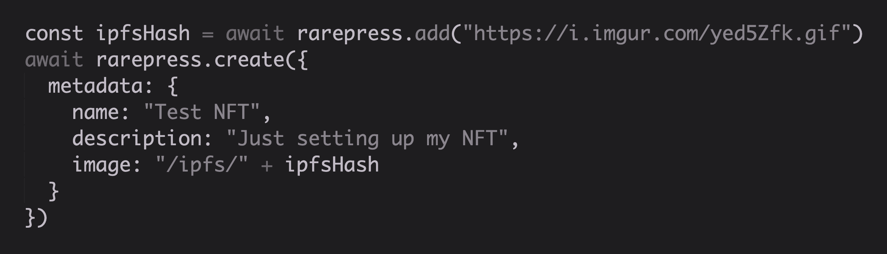
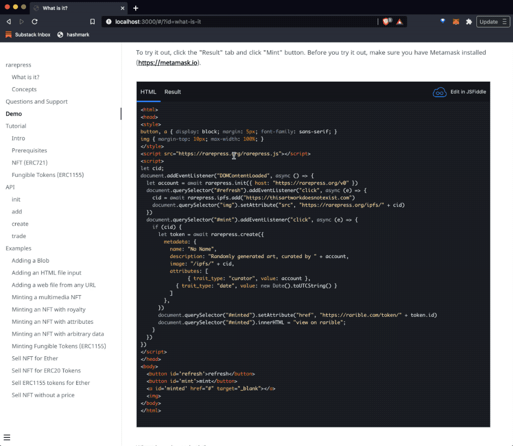
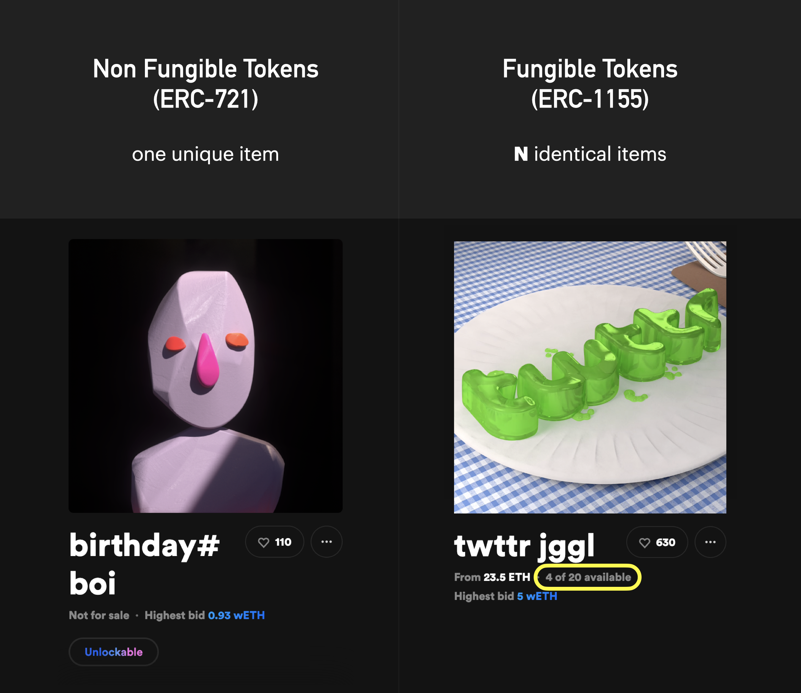
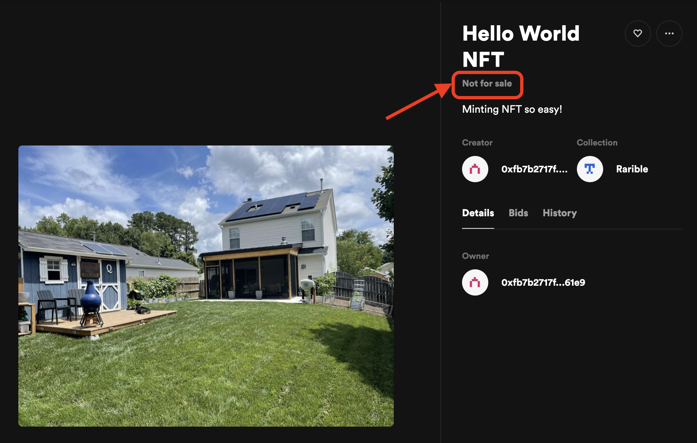
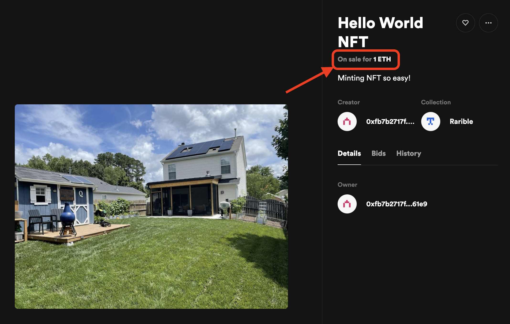

# rarepress

<div class='large'>NFT<br>Operating<br>System</div>


## Rarepress Explained in 2 Minutes

The following 2 minute video explains everything and demonstrates how everything works. Watch.

<div class='videoWrapper'>
<iframe width="1280" height="720" src="https://www.youtube.com/embed/F_xHeO_3LAM" title="YouTube video player" frameborder="0" allow="accelerometer; autoplay; clipboard-write; encrypted-media; gyroscope; picture-in-picture" allowfullscreen></iframe>
</div>

## Overview



Rarepress lets you turn anything into **[Non Fungible Tokens (ERC721)](https://eips.ethereum.org/EIPS/eip-721)** or **[Fungible Tokens (ERC1155)](https://eips.ethereum.org/EIPS/eip-1155)** with simple API calls, powered by [decentralized Rarible NFT marketplace protocol](https://docs.rarible.com/) on Ethereum.

Rarepress interacts with the Rarible contract through super simple interface to take care of all the complex details of minting and managing NFTs so you can just focus on tokenizing whatver you want.

1. **No Ether needed:** No need to own Ether or spend money. You can mint anything as NFT for free thanks to Lazy minting (an approach where the transaction costs of minting the NFT is deferred to the first buyer instead of the creator).
2. **No prior Ethereum exprience needed:** You don't need to learn Web3.js, Solidity, or any of the Ethereum related tech. If you know JavaScript, you can start building programmatic NFT systems in just a few minutes!
3. **No maintenance needed:** No need to write and deploy a solidity contract. No need to manage your own backend for managing tokens. No need to run your own IPFS node. It's all taken care of automatically.
4. **No limits:** With NFT programming this easy, Rarepress opens doors to all kinds of tokenization possibilities. Use your imagination, you can tokenize literally ANYTHING! NFTs are not just for art or collectibles, it can be much more!

Basically, all you need is a couple of lines of JavaScript code and you can mint NFT in any app.


## Concepts

> If you just want to get started, just try the demo first. You can come back and learn more then.

There are only three concepts to understand when it comes to NFT:

1. **Transferrable Digital Object:** "Transferrable Digital Object" as an abstraction for representing NFT
2. **Virtual IPFS:** Free, Zero friction file handling for attaching IPFS files to NFT
3. **Trade:** Dead simple and intuitive abstraction for representing Buy/Sell orders (trade positions) for minted NFTs

### 1. Transferrable Digital Object

**What is an NFT anyway?**

Is it art? Is it collectible? Is it property? Actually it's very simple. 

**An NFT is nothing more than a digital object that can be transferred, but not be copied.** Also, when you tokenize offline objects, such as real estate, they too become "online objects that can be transferred".

Art, collectibles, digital properties, all just happen to be **"digital objects that can be transferred"**, but they are just the tip of the iceberg.

It's a simple but powerful concept. If the WWW enabled **digital objects that can be copied**, NFTs add a new diimension previously impossible with the web.

In Rarepress, you create such "transferrable digital objects" using a method called:

```javascript
rarepress.create(<object description>)
```


### 2. Virtual IPFS

One of the biggest hurdles of building NFTs is dealing with [IPFS](https://ipfs.io/). You have to learn to run your own IPFS nodes or sign up for an IPFS pinning service, and incorporate all of those into your NFT minting app. 

All this is just unnecessary friction. Rarepress has a better way.

Rarepress completely gets rid of this step through an innovation called "Virtual IPFS". 

#### IPFSLess IPFS

Virtual IPFS is an HTTP gateway that stores and serves files under the IPFS CID **WITHOUT sharing on IPFS**. When you add your files to Rarepress, the files are stored with the computed IPFS CID as filename, and are immediately avilable over HTTP at `https://rarepress.org/ipfs/<cid>`.

**Like a Mempool for IPFS:** The idea is, until you actually mint your files into NFT, they don't need to be on IPFS yet. Rarepress stores and serves the files under each file's corresponding IPFS CID WITHOUT sharing on IPFS yet. Then, once you mint the files into NFT, that's when the files get shared on IPFS and are replicated to IPFS gateways (like ipfs.io and cloudflare-ipfs.com) and NFT marketplaces who also pin your IPFS files for you (like [Rarible](https://rarible.com), [Opensea](https://opensea.io/blog/announcements/decentralizing-nft-metadata-on-opensea/), and more).

**Ephemeral:** Once your files have been tokenized, the virtual IPFS file runs garbage collection after a while since you no longer need to access the files through the Virtual IPFS, but can access directly on the public IPFS network itself.

For example, when you run the following command:

```javascript
let cid = await rarepress.add(<file buffer>)
```

it adds the file to VIPFS (Virtual IPFS), which is then instantly served at `https://rarepress.org/ipfs/<cid>`

It's important to note that the file is NOT yet hosted on IPFS at this point.

Once you mint an NFT with your file, the files are deleted from VIPFS later through garbage collection, and you can no longer access the file at `https://rarepress.org/ipfs/<cid>`. However, now the files are stored on IPFS, so you can access the same file at `https://ipfs.io/ipfs/<cid>`.

#### Turn any web resource into IPFS, effortlessly.

Virtual IPFS also lets you import any web resource into IPFS. As long as you can reach them over HTTP, they can be easily imported into IPFS and then to your NFT.

For example when you run the following command from your web app:

```javascript
let cid = await rarepress.add("https://i.imgur.com/yed5Zfk.gif")
```

It will automatically fetch the resource at the location `https://i.imgur.com/yed5Zfk.gif`, compute its IPFS CID, store them in VIPFS (Virtual IPFS), and instantly serve them at `https://rarepress.org/ipfs/<computed CID>`.

You can use this feature for displaying previews before the NFT has been actually minted, among many other use cases.


### 3. Trade

Once an NFT comes into existence, it becomes tradeable (buy/sell).

Rarepress has adopted the terminology "trade" instead of "order" (which is the term Rarible protocol uses), but they can be used interchangeably.

When you want to trade your "digital object" (NFT), you simply call a trade function to construct your trade position:

```javascript
rarepress.trade.create(<trade position description>)
```


## Community and Support

<div class='highlight'>

If you run into problems, have questions, feature suggestions, or anything else, feel free to reach out through the following channels:

- **Discord:** https://discord.gg/BZtp5F6QQM
- **Twitter:** https://twitter.com/skogard
- **Email:** skogard@protonmail.com

Also, to stay updated on feature additions and updates, follow on [Twitter](https://twitter.com/skogard)

</div>

---

# Demo

## How it works

Minting and trading NFTs using Rarepress is so simple that it fits into a single JSFiddle, 100% serverless frontend code!

This demo is a web app that uses randomly generated art from https://thisartworkdoesnotexist.com/ and lets you tokenize them as NFTs.

**How it works:** Click the "refresh" button to get the art you like, and press "mint" to mint it as NFT. That's all!



## Try yourself

To try it out, click the "Result" tab and click "Mint" button from the JSFiddle below. Before you try it out, make sure you have Metamask installed (https://metamask.io).

<iframe width="100%" height="900" src="//jsfiddle.net/skogard/ktd3c7on/39/embedded/html,result/dark/" allowfullscreen="allowfullscreen" allowpaymentrequest frameborder="0"></iframe>

What does the code do? Let's walk through the above code quickly.

### 1. Initialize Rarepress

The following line initializes Rarepress.

```javascript
const rarepress = new Rarepress();
let account = await rarepress.init({ host: "https://rarepress.org/v0" })
```

### 2. Import image from "thisartdoesnotexist.com" and add to Rarepress

When you click the "refresh" button, it fetches the randomly generated image from https://thisartdoesnotexist.com and adds it to Rarepress IPFS, and generates an IPFS hash (cid). 

Then it displays the preview from the Rarepress virtual IPFS at `"https://rarepress.org/ipfs/" + cid`:

```javascript
document.querySelector("#refresh").addEventListener("click", async (e) => {
  cid = await rarepress.add("https://thisartworkdoesnotexist.com")
  document.querySelector("img").setAttribute("src", "https://rarepress.org/ipfs/" + cid)
})
```

### 3. Mint NFT

When you click the "mint" button, it creates an NFT with some metadata:

```javascript
let token = await rarepress.create({
  metadata: {
    name: "No Name",
    description: "Randomly generated art, curated by " + account,
    image: "/ipfs/" + cid,
    attributes: [
      { trait_type: "powered by", value: "Rarepress https://rarepress.org" },
      { trait_type: "curator", value: account },
      { trait_type: "date", value: new Date().toUTCString() },
      { trait_type: "license": value: "DEMO PURPOSE ONLY. FROM https://thisartworkdoesnotexist.com" }
    ]
  },
})
```

And that is how you mint an NFT with Rarepress! 

No server. No Solidity. No web3. No IPFS stuff, No nothing. Just a couple of lines of JavaScript code, but achieves the exact same effect.

So, want to learn more? Read on.

---

# Tutorial

## Intro

Before we begin, let's first start by understanding the difference between **Non Fungible Tokens (NFT)** and **Fungible Tokens**.



1. **Non Fungible Tokens (NFT):** It's ONE unique item. (In above example, there is ever only one unique "birtday#boi" NFT). It's powered by Ethereum's [ERC-721](https://eips.ethereum.org/EIPS/eip-721) standard.
2. **Fungible Tokens:** It's a bundle of **N** identical items (In above example, there are 20 identical tokens in the 'twttr jggl' universe, of which 4 are on sale). Essentially, you can use these tokens like ERC20 tokens. It's powered by Ethereum's [ERC-1155](https://eips.ethereum.org/EIPS/eip-1155) standard.

> **NOTE 1**
>
> Technically ERC-1155 Tokens were designed as an extension of ERC-721 to facilitate [BOTH Non fungible and fungible tokens](https://eips.ethereum.org/EIPS/eip-1155), but Rarepress is an opinionated system that uses ERC-721 for Non fungible tokens and ERC-1155 for fungible tokens exclusively for simplicity.
>
> So from this point on, we shall call ERC-721 "non fungible tokens" and ERC-1155 "fungible tokens".

> **NOTE 2**
>
> Not many people realize the huge potential of [Rarible protocol](https://rarible.org) giving us the ability to **lazy mint NOT ONLY NFTs (Non Fungible Tokens), but also fungible tokens.**
>
> This means **you can start your own ERC20-like coins instantly, without spending any money.**

## Prerequisites

This tutorial assumes that you have already installed [Metmask wallet](https://metamask.io/). If you haven't, go install it first.


That's about all you need before getting started. Everything will happen in the frontend so You only need a web browser.

Now we are ready. Let's get right to some working examples.

> **NOTE**
>
> The examples below are using the rinkeby testnet https://rinkeby.rarepress.org/v0 but if you want to put it on mainnet, simply switch out the URL to https://rarepress.org/v0


## NFT (ERC721)

### Mint

Let's try minting a unique NFT (ERC721).

We will build the most minimal web app possible, it won't even have a UI. It simply has a "mint" function and the mint function is automatically called when the page loads.

Copy and paste the following code and save it as `index.html`.

```html
<html>
<body>
<pre></pre>
<script src="https://unpkg.com/rarepress.js@0.0.15"></script>
<script>
const mint = async () => {
  const rarepress = new Rarepress();
  await rarepress.init({ host: "https://rinkeby.rarepress.org/v0" })
  let cid = await rarepress.add("https://i.imgur.com/7VtdUHN.jpeg")
  let token = await rarepress.create({
    metadata: {
      name: "Hello World NFT",
      description: "Minting NFT so easy!",
      image: "/ipfs/" + cid
    }
  })
  document.querySelector("pre").innerHTML = JSON.stringify(token, null, 2)
}
mint()
</script>
</body>
</html>
```

Start a local web server using something like [http-server](https://github.com/http-party/http-server) or whatever you like. Load the page in your browser.

Here's what's going on in the `mint()` function:

1. Initialize rarepress (`new Rarepress()`, and then `rarepress.init()`)
2. Add a file at https://i.imgur.com/7VtdUHN.jpeg to IPFS (`await rarepress.add("https://i.imgur.com/7VtdUHN.jpeg")`)
3. Create an NFT by specifying name, description and the image we just added to IPFS (`await rarepress.create()`)
4. Print the returned token inside a `pre` tag to inspect what the token looks like.

It should print something like:

```json
{
  "id": "0x6ede7f3c26975aad32a475e1021d8f6f39c89d82:113748116997632943908989974912943551603774609216661645898176697017925860590342",
  "contract": "0x6ede7f3c26975aad32a475e1021d8f6f39c89d82",
  "tokenId": "113748116997632943908989974912943551603774609216661645898176697017925860590342",
  "creators": [
    {
      "account": "0xfb7b2717f7a2a30b42e21cef03dd0fc76ef761e9",
      "value": 10000
    }
  ],
  "supply": "1",
  "lazySupply": "1",
  "owners": [
    "0xfb7b2717f7a2a30b42e21cef03dd0fc76ef761e9"
  ],
  "royalties": [],
  "date": "2021-07-03T07:08:08Z",
  "pending": [],
  "deleted": false
}
```

Here's what each attribute means:

1. `contract`: The contract address for the NFT (The Rarible NFT contract address)
2. `tokenId`: The tokenId for the minted NFT
3. `creators`: If you do not explicitly specify `creators`, it will automatically set it as the person who signed the message through the wallet. In this case, the account was `0xfb7b2717f7a2a30b42e21cef03dd0fc76ef761e9`. The `value` of 10000 means this is the sole creator (10000 is 100%).
4. `supply`: The supply is 1 because it's a unique NFT with only one in existence.
5. `owners`: The initial creators automatically become the owners in this case.
6. `royalties`: On-chain royalties for the NFT. In this case not specified so it's empty.

And that's literally it! Once you're done, go to Rarible's homepage and check that your minted NFT is there in the `created` tab under `my items`: https://rinkeby.rarible.com/items?tab=created



### Sell

Now that we know how to mint an NFT, let's learn how to sell it!

In the following code we will first mint an NFT, and then put it on sale by using the `rarepress.trade` API.

```html
<html>
<body>
<pre></pre>
<script src="https://unpkg.com/rarepress.js@0.0.15"></script>
<script>
const rarepress = new Rarepress();
const mint = async () => {
  let cid = await rarepress.add("https://i.imgur.com/7VtdUHN.jpeg")
  let token = await rarepress.create({
    metadata: {
      name: "Hello World NFT",
      description: "Minting NFT so easy!",
      image: "/ipfs/" + cid
    }
  })
  return token
}
const sell = async (tokenId) => {
  let trade = await rarepress.trade.create({
    what: {
      type: "ERC721",
      id: tokenId,
    },
    with: {
      type: "ETH",
      value: 10**18
    }
  })
  return trade
};
const mintAndSell = async () => {
  await rarepress.init({ host: "https://rinkeby.rarepress.org/v0" })
  let token = await mint()
  let trade = await sell(token.tokenId)
  document.querySelector("pre").innerHTML = JSON.stringify(trade, null, 2)
}
mintAndSell()
</script>
</body>
</html>
```

So what is going on here?

1. The `mint` function is not much different from the previous "mint" example (except that we've extracted out the init function)
2. We now have a `sell` function, which takes the `tokenId` of the minted token and creates a trade position (sell order).
3. Notice the `rarepress.trade.create()` takes an object with two attributes `what` and `with`
  - `what` describes which of your tokens you're trying to trade
    - `type` is `"ERC721"` because it's an NFT (ERC721).
    - `id` is the tokenId that was passed in
  - `with` describes which other asset you'd like to trade your token with
    - `type` is `"ETH"` so you want to trade it for ETH (Ethereum)
    - `value` is `10**18` (10 to the 18th power). Note that it doesn't mean you want to sell it at `10**18` ETH, the unit is in wei, the smallest unit of Ethereum. therefore it's saying "I want to sell at 10 to the 18th power wei (which is 1ETH)".

When you run it, you will be asked to sign twice. First for minting, and then for creating the sell order.

When you sign the sell order and submit using the `create()` method, it will print something like the following:

```json
{
  "type": "RARIBLE_V2",
  "maker": "0xfb7b2717f7a2a30b42e21cef03dd0fc76ef761e9",
  "make": {
    "assetType": {
      "assetClass": "ERC721_LAZY",
      "contract": "0x6ede7f3c26975aad32a475e1021d8f6f39c89d82",
      "tokenId": "113748116997632943908989974912943551603774609216661645898176697017925860590347",
      "uri": "/ipfs/bafkreigbx7zamurv36u2obmsq2cq5bzlo67ws6x4o32hiq3baapfbf3ztm",
      "creators": [
        {
          "account": "0xfb7b2717f7a2a30b42e21cef03dd0fc76ef761e9",
          "value": 10000
        }
      ],
      "royalties": [],
      "signatures": [
        "0x1bc3430cbf13d35ae7d76bda54793aac30b710e1424de584e8a86a394c66d9147812df91ff1d3376bd67fe5bef31264a0e49ff36313b1b2d43a291951c3a76161c"
      ]
    },
    "value": "1"
  },
  "take": {
    "assetType": {
      "assetClass": "ETH"
    },
    "value": "1000000000000000000"
  },
  "fill": "0",
  "makeStock": "1",
  "cancelled": false,
  "salt": "0x00000000000000000000000000000000000000000000000002416be4f1667275",
  "data": {
    "dataType": "RARIBLE_V2_DATA_V1",
    "payouts": [],
    "originFees": []
  },
  "signature": "0x9dcc5d3131353219a529946e5bff86bab480846b07222cdccdc327b08033a5fb07343379c654157956e2acc2f446e1dddc8c9e44a45b03b183b8b39beebbfbbc1b",
  "createdAt": "2021-07-03T07:22:09Z",
  "lastUpdateAt": "2021-07-03T07:22:09Z",
  "pending": [],
  "hash": "0x63724272e5a97e4d2c10d5c20869b796822370083822540642863f17b6955356",
  "makeBalance": "0",
  "makePriceUsd": 2146.3933729605396
}
```

This is the final order that was submitted to Rarible protocol. Here's what some of the attributes mean:

1. `maker`: The person who signed the order (You)
2. `make`: The "maker" condition. This condition was described through the `what` attribute in the Rarepress code above. Basically this describes what asset you're trying to trade.
3. `take`: The "taker" condition. This condition was described through the `with` attribute in the Rarepress code above. Basically this describes what asset you're trying to exchange your asset with. In this case it's "ETH" with the value of "1000000000000000000"
4. `signature`: This is the signature of the entire order to prove authenticity.

There are other attributes as well but they're not important at this stage. You can learn more as you start playing with Rarepress.

And that's all there is!

Now if you go to https://rinkeby.rarible.com/items?tab=created you will find your minted token, but this time it's not only listed there but also put on sale for **1 ETH**.



Note that if you only minted the item and didn't create a sell order, it would just say "Not for sale", like this:


And that's it! Simple! No solidity. No web3. This is literally all you ever need to tokenize and trade ANYTHING on Ethereum.

## Fungible Tokens (ERC1155)

Now let's try ERC1155, creating a bundle of N identical items. To put it simply, you can think of these almost like ERC20 tokens. 

### Mint

With fungible tokens, you are creating N items with the same unique property.

> For example, Bitcoin is a "fungible token" because it's a token system with 21,000,000 items of same unique property.

With Rarepress, minting fungible tokens is as simple as adding one line to the ER721 code: You just need to add a `supply` attribute (in this case 21,000,000).

```html
<html>
<body>
<pre></pre>
<script src="https://unpkg.com/rarepress.js@0.0.15"></script>
<script>
const mint = async () => {
  // 1. Initialize
  const rarepress = new Rarepress();
  await rarepress.init({ host: "https://rinkeby.rarepress.org/v0" })
  // 2. Add files to IPFS
  let cid = await rarepress.add("https://upload.wikimedia.org/wikipedia/commons/thumb/9/9a/BTC_Logo.svg/1200px-BTC_Logo.svg.png")
  // 3. Mint NFT bundle made up of 21000000 items
  let token = await rarepress.create({
    metadata: {
      name: "Bitcoin",
      description: "A Peer-to-Peer Electronic Cash System",
      image: "/ipfs/" + cid
    },
    supply: 21000000
  })
  document.querySelector("pre").innerHTML = JSON.stringify(token, null, 2)
}
mint()
</script>
</body>
</html>
```

We won't go through the details this time because it's pretty much the same (except for the "supply" part). If you understand the NFT tutorial, you'll understand how to mint fungible tokens too.

And just like NFT, this is literally all there is to minting fungible tokens! You can find your token at https://rarible.com/items?tab=created

### Sell

Let's put our Bitcoin fungible tokens up for sale. 


```html
<html>
<body>
<pre id='token'></pre>
<pre id='trade'></pre>
<script src="https://unpkg.com/rarepress.js@0.0.15"></script>
<script>
const rarepress = new Rarepress();
const mint = async () => {
  let cid = await rarepress.add("https://i.imgur.com/7VtdUHN.jpeg")
  let token = await rarepress.create({
    metadata: {
      name: "Bitcoin",
      description: "A Peer-to-Peer Electronic Cash System",
      image: "/ipfs/" + cid,
    },
    supply: 21000000
  })
  return token
}
const sell = (tokenId) => {
  let trade = await rarepress.trade.create({
    what: {
      type: "ERC1155",
      id: tokenId,
      value: 21000000
    },
    with: {
      type: "ETH",
      value: 10**18
    }
  })
};
const mintAndSell = async () => {
  await rarepress.init({ host: "https://rinkeby.rarepress.org/v0" })
  let token = await mint()
  document.querySelector("#token").innerHTML = JSON.stringify(token, null, 2)
  let trade = await sell(token.tokenId)
  document.querySelector("#trade").innerHTML = JSON.stringify(trade, null, 2)
}
mintAndSell()
</script>
</body>
</html>
```

It's not so much different from our NFT example. The difference is:

1. the `rarepress.create()` now has an additional attribute named `supply`, whose value is 21 million.
2. in `rarepress.trade.create()`,
  - the `what.type` is "ERC1155" (Fungible token) instead of "ERC721"
  - the `what.value` is 21000000, because we are going to put all of the total supply (21 million) on sale.

Basically, we are creating a sell order that says "I am going to sell all of the 21 million Bitcoin tokens at 1 ETH each".

This is pretty much all you need to know to tokenize anything, but Rarepress has other advanced features. To learn more, go on to the following API section:

---

# Install

You can use rarepress both as a vanilla JavaScript `<script>` tag, or import it in your frontend web app as a module

## JavaScript Script Tag

All you need to do is include a `<script>` tag:

```
<script src="https://unpkg.com/rarepress.js@0.0.15"></script>
```

## Import from JS Frameworks

To import rarepress.js from JS frameworks like React, Vue, etc., first install the module:

```
npm install rarepress.js
```

or

```
yarn add rarepress.js
```

Then you can import it with `require`, like this:

```javascript
/**************************************************************
*
* The following code assumes:
* 1. it's being executed in the browser context
* 2. the browser has Metamask installed
*
**************************************************************/
const Rarepress = require('rarepress.js')
const rarepress = new Rarepress();
rarepress.init({ host: "https://rinkeby.rarepress.org/v0" }).then((address) => {
  rarepress.add( . . . )  
})
```

Or using the `import` syntax:

```javascript
/**************************************************************
*
* The following code assumes:
* 1. it's being executed in the browser context
* 2. the browser has Metamask installed
*
**************************************************************/
import Rarepress from "rarepress.js"
const rarepress = new Rarepress();
rarepress.init({ host: "https://rinkeby.rarepress.org/v0" }).then((address) => {
  rarepress.add( . . . )  
})
```

> If you have trouble with the workflow or found a bug, please open an issue on GitHub
>
> https://github.com/skogard/rarepress.js

---

# API

0. constructor: instantiate a rarepress object
1. init: initialize (for customization)
2. add: add a file to IPFS
3. create: create a token
4. trade: create orders on the marketplace
5. folder: create a folder from IPFS files
6. tokens: Fetch tokens from a user, or fetch by tokenId

## constructor

The `Rarepress` is globally exposed. You must first instantiate a `rarepress` obejct from the class:

```
const rarepress = new Rarepress()
```

## init

initialize rarepress

```javascript
const address = await rarepress.init({
  host: <HOST PROVIDER URL>
})
```

### Parameters

You can point to a Rarepress provider endpoint. Currently supported endpoints are:

1. https://rarepress.org/v0: for Ethereum mainnet
2. https://rinkeby.rarepress.org/v0: for Rinkeby testnet.
3. https://ropsten.rarepress.org/v0: for Ropsten testnet.

### Return Value

returns [promise](https://developer.mozilla.org/en-US/docs/Web/JavaScript/Reference/Global_Objects/Promise), which when resolved, contains the Ethereum address of the currently logged-in user. 

## add

Add files to Ephemeral IPFS. 

```javascript
const cid = await rarepress.add(<item>)
```

Once you call `rarepress.add()` and it successfully returns a cid, the file you add is instantly accessible over HTTP at:

1. `https://rarepress.org/ipfs/<cid>` if you are using the mainnet provider
2. `https://rinkeby.rarepress.org/ipfs/<cid>` if you are using the rinkeby rarepress provider
3. `https://ropsten.rarepress.org/ipfs/<cid>` if you are using the ropsten rarepress provider

It is important to understand that these files are treated as ephemeral (hence the name ephemeral IPFS). They are meant to be accessible at those URLs only until you mint them as NFTs.

Once you mint them into NFTs, they are finally published to IPFS, and therefore will be accessible at `https://ipfs.io/ipfs/<cid>` gateway as well as other ways.

Why would this be helpful? There are many use cases but one obvious one is: You may want to use them to display previews before you mint, depending on what kind of NFT application you're building.

Just like how the NFT Lazy minting approach doesn't put transactions on the blockchain until the first sale is made, Ephemeral IPFS doesn't put files on IPFS until it needs to be published.


it adds the file to Rarepress's file system, which you can access at `https://rarepress.org/ipfs/<cid>`

But it's important to note that the file is NOT yet hosted on IPFS at this point.

Once you mint an NFT with your file, the Ephemeral IPFS files are deleted, and you can no longer access the file at `https://rarepress.org/ipfs/<cid>`. However, now the files are stored on IPFS, so you can access the same file at `https://ipfs.io/ipfs/<cid>`.

As a result, Rarepress Ephemeral IPFS acts as sort of a "mempool" for IPFS, which means it gets emptied out as the files are actually published to IPFS, which is the key to the efficiency of the system.

### Parameters

The `<item>` can be:

1. **ArrayBuffer:** Add [arraybuffer](https://developer.mozilla.org/en-US/docs/Web/JavaScript/Reference/Global_Objects/ArrayBuffer) to IPFS and get the IPFS hash (CID) back.
2. **Blob:** Add a [Blob](https://developer.mozilla.org/en-US/docs/Web/API/Blob) to IPFS and get the IPFS hash (CID) back.
3. **File:** Add a [File](https://developer.mozilla.org/en-US/docs/Web/API/File) to IPFS and get the IPFS hash (CID) back.
4. **URL:** Download the file from the URL and add to IPFS file, and return the CID.

### Return Value

returns a [promise](https://developer.mozilla.org/en-US/docs/Web/JavaScript/Reference/Global_Objects/Promise) which resolves to the [IPFS hash (CID)](https://docs.ipfs.io/concepts/content-addressing/) of the data you've added.


## create

Mint (create) a token

```javascript
const mint = await rarepress.create(<item>)
```

### Parameters

The `<item>` has the following attributes:

- `metadata`: Metadata for the NFT **(required)**
  - `name`: name of the token **(required)**
  - `description`: description of the token **(required)**
  - `image`: token image **(required)**
  - `attributes`: an array of attributes that follow the [NFT metadata standard](https://docs.opensea.io/docs/metadata-standards#section-attributes) (Each item must have two attributes `trait_type` and `value`)
  - any other arbitrary attributes you want to use: you don't have to use the `attributes` array, you can simply attach other arbitrary properties to the `metadata` object.
- `creators`: array of creators
- `royalties`: array of royalties
- `supply`: total supply of the token.
  - if left out, rarepress mints a single NFT (ERC721).
  - if set as 1, rarepress mints a single NFT (ERC721).
  - if set as any number larger than 1, rarepress mints a fungible token bundle (ERC1155)

### Return Value

returns a [promise](https://developer.mozilla.org/en-US/docs/Web/JavaScript/Reference/Global_Objects/Promise) which resolves to the final signed NFT mint object.

## trade

Trade tokens using [Rarible contract](https://rarible.org).

```javascript
let trade = await rarepress.trade.create(<trade condition>)
```

### Parameters

The [Rarible contract](https://rarible.org) provides very flexible ways to declare trade positions.

Rarepress has implemented an intuitive abstraction called `trade` that maps to all the attributes of the Rarible decentralized marketplace contract, so developers can easily understand and build declarative trade positions and send to the marketplace.

To create a `trade`, you pass the `<trade condition>` JavaScript object to the `rarepress.trade.create()` function. The `<trade condition>` is made up ofthe following attributes:

- `what`: What asset will I trade? **(required)**
  - `type`: `"ERC721"` or `"ERC1155"` **(required)**
  - `id`: tokenID **(required)**
  - `contract`: Contract ID (Only if it's ERC20 token. For example, for $RARI it's "0xfca59cd816ab1ead66534d82bc21e7515ce441cf")
  - `value`: The number of tokens you want to trade (Only if it's countable, such as ERC20, ERC1155, and ETH)
- `with`: What asset do I want to trade WITH? **(required)**
  - `type`: `"ERC721"` or `"ERC1155"` **(required)**
  - `id`: tokenID **(required)**
  - `contract`: Contract ID (Only if it's ERC20 token. For example, for $RARI it's "0xfca59cd816ab1ead66534d82bc21e7515ce441cf")
  - `value`: The number of tokens you want to trade (Only if it's countable, such as ERC20, ERC1155, and ETH)
- `who`: WHO is this trade intended for?
  - `from`: The Ethereum address of the person who's making this offer. If left out, it's automatically set as whoever is signing the trade.
  - `to`: The Ethereum address of the person who this offer is intended for. If not used, anyone can take the offer as long as they can match the condition.
- `when`: When shall this trade offer be considered valid? If left out, the trade offer is immediately effective without a deadline.
  - `from`: when does the trade offer start being valid?
  - `to`: when does the trade offer stop being valid?
- `how`: How shall the trade be executed?
  - `originFees`: Describe a one time fee that gets charged ONLY the first time a sales is made.
  - `payouts`: Describe who will be paid in what proportion.


### Return Value

returns a [promise](https://developer.mozilla.org/en-US/docs/Web/JavaScript/Reference/Global_Objects/Promise) which resolves to the final signed trade position object.

## folder

Create an IPFS folder from a collection of IPFS files

```javascript
const cid = await rarepress.folder(<folder mapping>)
```

The `<folder mapping>` is a mapping between file names and their corresponding IPFS CIDs.

> NOTE
>
> For the sake of simplicity, a folder can only contain files, and cannot contain child folders.

### Parameters

The `<folder mapping>` is a key/value object made up of filenames and their corresponding IPFS CIDs. Here's what it looks like:

```javascript
const cid = await rarepress.folder({
  <filename1>: <IPFS CID1>,
  <filename2>: <IPFS CID2>,
  <filename3>: <IPFS CID3>
})
```

To create a folder you need an existing set of IPFS CIDs to put in your folder. You may achieve this by adding files to IPFS using `rarepress.add()`.

Here's a quick example:

```javascript
// 1. Add files to rarepress and create a mapping between filenames and the IPFS hash returned by rarepress.add()
let cid0 = await rarepress.add("https://raw.githubusercontent.com/skogard/aperank/main/public/aperank.png")
let cid1 = await rarepress.add("https://raw.githubusercontent.com/skogard/aperank/main/README.md")
let cid2 = await rarepress.add('https://raw.githubusercontent.com/skogard/aperank/main/index.js')
let cid3 = await rarepress.add("https://raw.githubusercontent.com/skogard/aperank/main/package.json")
let mapping = {
  "aperank.png": cid0,
  "readme.md": cid1,
  "index.js": cid2,
  "package.json": cid3
}
// 2. Create a folder by passing the mapping to rarepress.folder()
let folder_cid = await rarepress.folder(mapping)
```

You can also do abbreviate the whole thing into a single line, so that files are added and then the folder is created from the files in a single line:

```javascript
let folder_cid = await rarepress.folder({
  "aperank.png": await rarepress.add("https://raw.githubusercontent.com/skogard/aperank/main/public/aperank.png"),
  "readme.md": await rarepress.add("https://raw.githubusercontent.com/skogard/aperank/main/README.md"),
  "index.js": await rarepress.add('https://raw.githubusercontent.com/skogard/aperank/main/index.js'),
  "package.json": await rarepress.add("https://raw.githubusercontent.com/skogard/aperank/main/package.json")
})
```

### Return Value

returns a [promise](https://developer.mozilla.org/en-US/docs/Web/JavaScript/Reference/Global_Objects/Promise) which resolves to the [IPFS hash (CID)](https://docs.ipfs.io/concepts/content-addressing/) of the resulting folder.

You can use the folder CID when creating your NFT by constructing the file paths using the folder CID. Example:

```javascript
let folder_cid = await rarepress.folder({
  "aperank.png": await rarepress.add("https://raw.githubusercontent.com/skogard/aperank/main/public/aperank.png"),
  "readme.md": await rarepress.add("https://raw.githubusercontent.com/skogard/aperank/main/README.md"),
  "index.js": await rarepress.add('https://raw.githubusercontent.com/skogard/aperank/main/index.js'),
  "package.json": await rarepress.add("https://raw.githubusercontent.com/skogard/aperank/main/package.json")
})
let token = await rarepress.create({
  metadata: {
    name: "aperank",
    description: "Rank Bored Apes by rare factor, powered by Apebase.",
    image: "/ipfs/" + folder_cid + "/aperank.png",
    attributes: [{
      trait_type: "readme.md",
      value: "/ipfs/" + folder_cid + "/readme.md"
    }, {
      trait_type: "index.js",
      value: "/ipfs/" + folder_cid + "/index.js"
    }, {
      trait_type: "package.json",
      value: "/ipfs/" + folder_cid + "/package.json"
    }]
  }
})
```


## tokens

Fetch user tokens created with Rarepress using HTTP GET requests.

> Currently there is no JavaScript binding for the tokens API. You can just use whichever HTTP request library or whichever programming language you use to fetch the tokens by making a GET request

### 1. user tokens

Get all tokens created by a user

```
GET <host>/v0/user/<user address>/tokens
```

Where:

- `host` can be:
  - https://rinkeby.rarepress.org
  - https://ropsten.rarepress.org
  - https://rarepress.org
- `address` is the user's ETH address to filter by

Additional available query parameters for pagination:

- `skip`: Similar to [MongoDB's skip](https://docs.mongodb.com/manual/reference/method/cursor.skip/). Set an offset to start from.
- `limit`: Similar to [MongoDB's limit](https://docs.mongodb.com/manual/reference/method/cursor.limit/). Set how many items to include in a page.

#### Examples

Simple query (default 100 items)

```javascript
const address = "0x73316d4224263496201c3420b36cdda9c0249574"
const url = `https://rarepress.org/v0/user/${address}/tokens`
const res = await fetch(url).then((res) => { return res.json() })
console.log(`tokens owned by ${address}: ${res.result}`)
```

Pagination (using `skip` and `limit`)

```javascript
const address = "0x73316d4224263496201c3420b36cdda9c0249574"
const skip = 10   // page starts at 10th most recent item
const limit = 10  // page includes 10 items
const url = `https://rarepress.org/v0/user/${address}/tokens?skip=${skip}&limit=${limit}`
const res = await fetch(url).then((res) => { return res.json() })
console.log(`tokens owned by ${address}: ${res.result}`)
```

### 2. user token by tokenId

Get a token created by a user, by tokenId

```
GET <host>/v0/user/<user address>/tokens/<tokenId>
```

Where:

- `host` can be:
  - https://rinkeby.rarepress.org
  - https://ropsten.rarepress.org
  - https://rarepress.org
- `address` is the user's ETH address to filter by

#### Examples

Get a user's token by tokenId

```javascript
const address = "0x73316d4224263496201c3420b36cdda9c0249574"
const tokenId = "52103307166765014994970427877263908096137622415883594758114461278185103294479"
let url = `https://rarepress.org/v0/user/${address}/tokens/${tokenId}`
let res = await fetch(url).then((res) => { return res.json() })
console.log(`token: ${res.result}`)
```

---

# Examples

## Adding a Blob

```javascript
let fileParts = ['<a id="a"><b id="b">hey!</b></a>']; // an array consisting of a single DOMString
let blob = new Blob(aFileParts, {type : 'text/html'}); // the blob
let cid = await rarepress.add(blob)
```

## Adding an HTML file input

```javascript
let input = document.querySelector('input[type=file]');
input.addEventListener('change', async (event) => {
  let file = input.files[0];
  let cid = await rarepress.add(file)
})
```

Here's a functional JSFiddle (Completely serverless!):

<iframe width="100%" height="900" src="//jsfiddle.net/skogard/rxysw5oc/40/embedded/html,result/dark/" allowfullscreen="allowfullscreen" allowpaymentrequest frameborder="0"></iframe>

## Adding a web file from any URL

If you add a URL, Rarepress will automatically fetch the file behind the URL, turn it into IPFS, and return the IPFS hash (CID).

```javascript
let cid = await rarepress.add("https://etherscan.io/images/logo-ether.png")
```

## Minting a multimedia NFT

Many marketplace platforms allow you to tokenize video, audio, and other multimedia files.

To do this, you can use an attribute named `animation_url`.

```javascript
const rarepress = new Rarepress();
let account = await rarepress.init({ host: "https://rinkeby.rarepress.org/v0" })
const cid = await rarepress.add("https://file-examples-com.github.io/uploads/2017/04/file_example_MP4_640_3MG.mp4")
const token = await rarepress.create({
  metadata: {
    name: "VideoToken",
    description: "Tokenize video",
    image: "/ipfs/" + cid,
  },
})
```

## Minting from Canvas

Adding blobs to Rarepress is easy, it's the same syntax:

```javascript
await rarepress.add(<blob>)
```

You can use this to export Canvas element directly to NFT using the [`toBlob()` Canvas API](https://developer.mozilla.org/en-US/docs/Web/API/HTMLCanvasElement/toBlob):

```javascript
document.querySelector("canvas").toBlob(async (blob) => {
  let cid = await rarepress.add(blob)
})
```

Here's a full fledged example for drawing stuff to canvas and then tokenizing:

<iframe width="100%" height="1000" src="//jsfiddle.net/skogard/w3hsv8m7/8/embedded/html,result/dark/" allowfullscreen="allowfullscreen" allowpaymentrequest frameborder="0"></iframe>

## Minting an NFT with royalty

We will create an NFT with 20% royalty that goes to the creator.

Create a fungible token system of 21000000 tokens named "BTC", whose description is "A peer to peer store of value":

```javascript
const rarepress = new Rarepress();
let account = await rarepress.init({ host: "https://rinkeby.rarepress.org/v0" })
const cid = await rarepress.add("https://bitcoin.org/img/icons/logotop.svg?1621851118")
const token = await rarepress.create({
  metadata: {
    name: "BTC",
    description: "A Peer to Peer Store of Value",
    image: "/ipfs/" + cid,
  },
  supply: 21000000,
  royalties: [{
    account: account,
    value: 2000
  }]
})
```

The `royalties` array includes items which consist of two attributes: `account` and `value`. In this case we want the creator address to get 20%, so we set 2000 as the value (Instead of using percentage we set an integer where the 100% equals to 10000).

## Minting an NFT with attributes

Now we have added an additional attribute named `attributes` under `metadata`, following the NFT metadata standard ([learn more](https://docs.opensea.io/docs/metadata-standards#section-metadata-structure)).

> If you use the "attributes" array, it will be nicely displayed on markeplace websites.

```javascript
const rarepress = new Rarepress();
let account = await rarepress.init({ host: "https://rinkeby.rarepress.org/v0" })
const cid = await rarepress.add("https://bitcoin.org/img/icons/logotop.svg?1621851118")
const token = await rarepress.create({
  metadata: {
    name: "ATTR",
    description: "An NFT with attributes array",
    image: "/ipfs/" + cid,
    attributes: [{
      trait_type: "emoji",
      value: "🤪"
    }, {
      trait_type: "velocity",
      value: 1000
    }]
  },
})
```

## Minting an NFT with arbitrary data

Attaching arbitrary data to your NFT can make your NFT programmable. Basically you can think of each token as a programmable object.

With Rarepress this is super simple. You simply attach additional properties to the `metadata` object.


```javascript
const rarepress = new Rarepress();
let account = await rarepress.init({ host: "https://rinkeby.rarepress.org/v0" })
const cid = await rarepress.add("https://bitcoin.org/img/icons/logotop.svg?1621851118")
const token = await rarepress.create({
  metadata: {
    name: "Programmable NFT",
    description: "Attach any JSON object to the NFT",
    image: "/ipfs/" + cid,
    user: account,
    location: {
      latitude: 24.9999993,
      longitude: -71.0087548
    }
  },
})
```

Here we've added 2 additional attributes `user` (to identify the creator of the item) and `location`. You can attach anything to the metadata. Use your imagination.

## Minting Fungible Tokens (ERC1155)

Let's create an Fungible Token System (ERC1155) of 21000000 tokens named "BTC", whose description is "A peer to peer store of value":

```javascript
const rarepress = new Rarepress();
let account = await rarepress.init({ host: "https://rinkeby.rarepress.org/v0" })
const cid = await rarepress.add("https://bitcoin.org/img/icons/logotop.svg?1621851118")
const token = await rarepress.create({
  metadata: {
    name: "BTC",
    description: "A Peer to Peer Store of Value",
    image: "/ipfs/" + cid,
  },
  supply: 21000000,
})
```

## Sell NFT for Ether

Rarepress uses the concept called "trade", which is equivalent to the protocol's "trade".

Basically when you say "I want to sell my NFT for 1 ETH", you're saying "I would like to make a trade position that says I will trade my NFT with anyone's 1 ETH". Here's the code:

```javascript
let trade = await rarepress.trade.create({
  what: {
    type: "ERC721",
    id: minted.tokenId,
  },
  with: {
    type: "ETH",
    value: 10**18
  }
})
console.log("trade = ", JSON.stringify(trade, null, 2))
```

## Sell NFT for ERC20 Tokens

The Rarible protocol also lets you easily create positions that interact with ERC20 tokens. 

The idea is the same. Instead of the type `"ETH"`, you use `"ERC20"`, and additionally specify the contract address for the ERC20 token.

Here's an example for selling an NFT for 100 RARI token (contract address 0xfca59cd816ab1ead66534d82bc21e7515ce441cf):

```javascript
let trade = await rarepress.trade.create({
  what: {
    type: "ERC721",
    id: minted.tokenId,
  },
  with: {
    type: "ERC20",
    contract: "0xfca59cd816ab1ead66534d82bc21e7515ce441cf",
    value: 100
  }
})
console.log("trade = ", JSON.stringify(trade, null, 2))
```

## Sell ERC1155 tokens for Ether

You can also sell ERC1155 tokens easily. Just need to set the `what.type` to "ERC1155", and `what.value` to how many coins you want to sell.

```javascript
let trade = await rarepress.trade.create({
  what: {
    type: "ERC1155",
    id: minted.tokenId,
    value: 42
  },
  with: {
    type: "ETH",
    value: 10**19
  }
})
console.log("trade = ", JSON.stringify(trade, null, 2))
```

## Sell NFT without a price

When you mint an NFT, it's automatically listed on Rarible's marketplace therefore you do not need to do anything other than simply minting.

